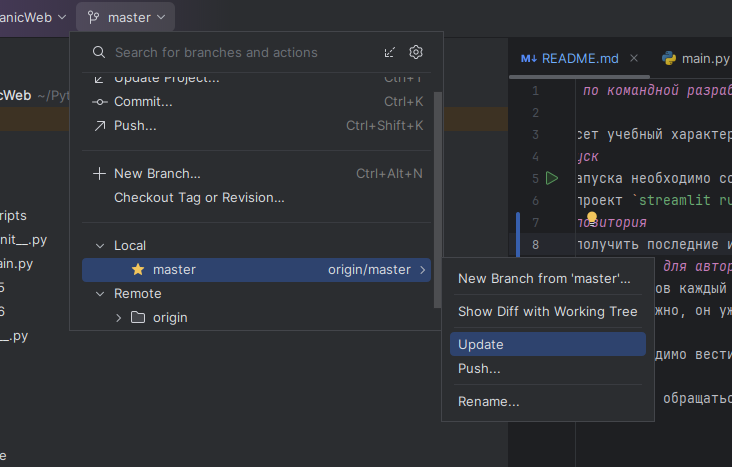
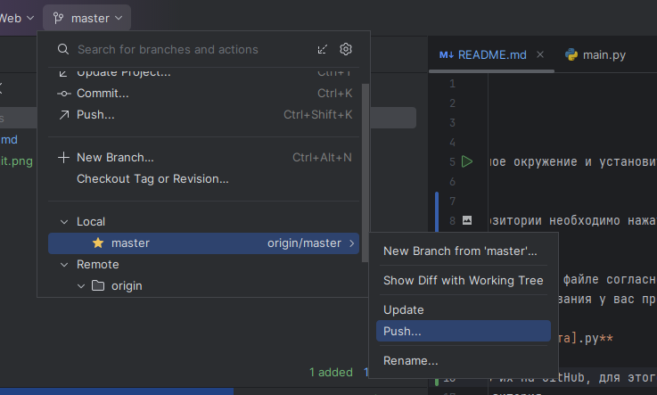

# Учебный проект по командной разработке
## О проекте
Данный проект несет учебный характер
## Локальный запуск
Для локального запуска необходимо создать виртуальное окружение и установить пакеты командой `pip install -r requirements.txt`
после запустить проект `streamlit run main.py`.
## Обновление репозитория
Для того что бы получить последние изменения в репозитории необходимо нажать на update вашей ветки: 
Или выполнить команду `git pull`.
## Порядок ведения проекта для авторов
Для минимализации конфликтов каждый автор ведет разработку в файле согласно вашему варианту **pages/var_[№ варианта]/main.py** 
Добавлять `data.csv` не нужно, он уже есть, для его использования у вас прописан путь к файлу в переменной `data_path`

Тесты ваших функций необходимо вести в **tests/var_[№ варианта].py**

После внесения ваших изменений необходимо доставить их на GitHub, для этого нужно внести commit и сделать push: 

При возникновении вопросов обращаться к автору репозитория.
